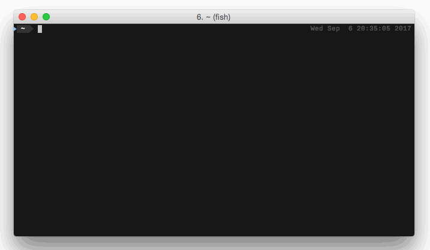
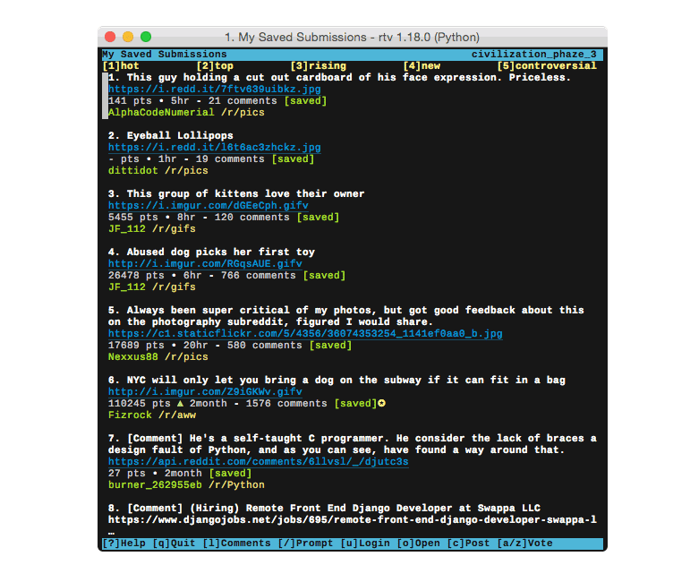
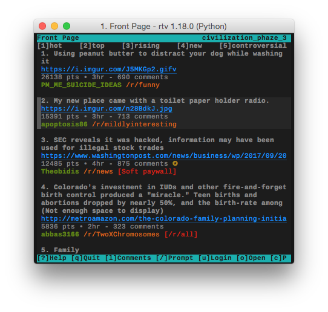
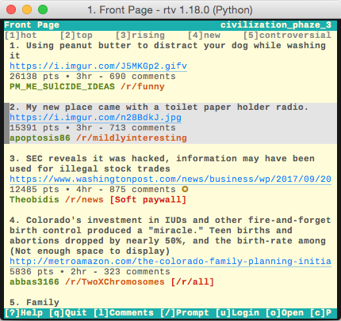
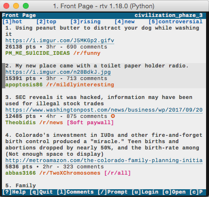
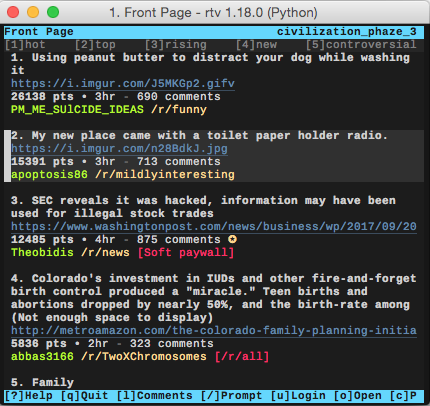

**THIS PROJECT IS NO LONGER MAINTAINED**

- [RTV Development is Shutting Down](https://github.com/michael-lazar/rtv/issues/696)
- [List of Alternative Projects](https://gist.github.com/michael-lazar/8c31b9f637c3b9d7fbdcbb0eebcf2b0a)

<h1 align="center">Reddit Terminal Viewer (RTV)</h1>

<p align="center">
A text-based interface (TUI) to view and interact with Reddit from your terminal.<br>
</p>

<p align="center">

</p>

## Table of Contents

* [Demo](#demo)  
* [Installation](#installation)  
* [Usage](#usage)  
* [Settings](#settings)
* [Themes](#themes)
* [FAQ](#faq)  
* [Contributing](#contributing)  
* [License](#license)  

## Demo

<p align="center">

</p>

You can use *telnet* or *ssh* to try out a lite version of RTV directly in your terminal, without needing to install it:

- ``$ telnet redditbox.us``
- ``$ ssh redditbox.us``

*[redditbox.us](https://redditbox.us/) is an independent project by Alex Jarmoszuk*

## Installation

### PyPI package

RTV is available on [PyPI](https://pypi.python.org/pypi/rtv/) and can be installed with pip:

```bash
$ pip install rtv
```

### Native packages

See [Repology](https://repology.org/metapackage/rtv/packages) for an up-to-date list of supported distro packages:

```bash
# macOS
$ brew install rtv

# Arch
$ pacman -S rtv

# Nix
$ nix-env -i rtv

# Debian
$ apt install rtv

# FreeBSD
$ pkg install rtv
```

### From source

```bash
$ git clone https://github.com/michael-lazar/rtv.git
$ cd rtv
$ python setup.py install
```

### Windows

RTV is not supported on Windows, due to a lack of resources and interest. Sorry!

## Usage

To run the program, type:

```bash
$ rtv --help
```

### Controls

Move the cursor using either the arrow keys or *Vim* style movement:

- Press <kbd>▲</kbd> and <kbd>▼</kbd> to scroll through submissions
- Press <kbd>▶</kbd> to view the selected submission and <kbd>◀</kbd> to return
- Press <kbd>space-bar</kbd> to expand/collapse comments
- Press <kbd>u</kbd> to login (this requires a web browser for [OAuth](https://github.com/reddit-archive/reddit/wiki/oauth2))
- Press <kbd>?</kbd> to open the help screen

Press <kbd>/</kbd> to open the navigation prompt, where you can type things like:

- ``/front``
- ``/r/commandprompt+linuxmasterrace``
- ``/r/programming/controversial``
- ``/u/me``
- ``/u/multi-mod/m/art``
- ``/domain/github.com``

See [CONTROLS](CONTROLS.md) for the full list of commands.

## Settings

### Configuration File

Configuration files are stored in the ``{HOME}/.config/rtv/`` directory.

Check out [rtv.cfg](rtv/templates/rtv.cfg) for the full list of configurable options. You can clone this file into your home directory by running:

```bash
$ rtv --copy-config
```

### Viewing Media Links

You can use [mailcap](https://en.wikipedia.org/wiki/Media_type#Mailcap) to configure how RTV will open different types of links.

<p align="center">

</p>

A mailcap file allows you to associate different MIME media types, like ``image/jpeg`` or ``video/mp4``, with shell commands. This feature is disabled by default because it takes a few extra steps to configure. To get started, copy the default mailcap template to your home directory.

```bash
$ rtv --copy-mailcap
```

This template contains examples for common MIME types that work with popular reddit websites like *imgur*, *youtube*, and *gfycat*. Open the mailcap template and follow the [instructions](rtv/templates/mailcap) listed inside.

Once you've setup your mailcap file, enable it by launching rtv with the ``rtv --enable-media`` flag (or set it in your **rtv.cfg**)

### Environment Variables

The default programs that RTV interacts with can be configured through environment variables:

<table>
  <tr>
  <td><strong>$RTV_EDITOR</strong></td>
  <td>A program used to compose text submissions and comments, e.g. <strong>vim</strong>, <strong>emacs</strong>, <strong>gedit</strong>
  <br/> <em>If not specified, will fallback to $VISUAL and $EDITOR in that order.</em></td>
  </tr>
  <tr>
  <td><strong>$RTV_BROWSER</strong></td>
  <td>A program used to open links to external websites, e.g. <strong>firefox</strong>, <strong>google-chrome</strong>, <strong>w3m</strong>, <strong>lynx</strong>
  <br/> <em>If not specified, will fallback to $BROWSER, or your system's default browser.</em></td>
  </tr>
  <tr>
  <td><strong>$RTV_URLVIEWER</strong></td>
  <td>A tool used to extract hyperlinks from blocks of text, e.g. <a href=https://github.com/sigpipe/urlview>urlview</a>, <a href=https://github.com/firecat53/urlscan>urlscan</a>
  <br/> <em>If not specified, will fallback to urlview if it is installed.</em></td>
  </tr>
</table>

### Clipboard

RTV supports copying submission links to the OS clipboard. On macOS this is supported out of the box.
On Linux systems you will need to install either [xsel](http://www.vergenet.net/~conrad/software/xsel/) or [xclip](https://sourceforge.net/projects/xclip/).

## Themes

Themes can be used to customize the look and feel of RTV

<table>
  <tr>
    <td align="center">
      <p><strong>Solarized Dark</strong></p>
      </img>
    </td>
    <td align="center">
      <p><strong>Solarized Light</strong></p>
      </img>
    </td>
  </tr>
  <tr>
    <td align="center">
      <p><strong>Papercolor</strong></p>
      </img>
    </td>
    <td align="center">
      <p><strong>Molokai</strong></p>
      </img>
    </td>
  </tr>
</table>

You can list all installed themes with the ``--list-themes`` command, and select one with ``--theme``. You can save your choice permanently in your [rtv.cfg](rtv/templates/rtv.cfg) file. You can also use the <kbd>F2</kbd> & <kbd>F3</kbd> keys inside of RTV to cycle through all available themes.

For instructions on writing and installing your own themes, see [THEMES.md](THEMES.md).

## FAQ

<details>
 <summary>Why am I getting an error during installation/when launching rtv?</summary>
 
  > If your distro ships with an older version of python 2.7 or python-requests,
  > you may experience SSL errors or other package incompatibilities. The
  > easiest way to fix this is to install rtv using python 3. If you
  > don't already have pip3, see http://stackoverflow.com/a/6587528 for setup
  > instructions. Then do
  >
  > ```bash
  > $ sudo pip uninstall rtv
  > $ sudo pip3 install -U rtv
  > ```

</details>
<details>
  <summary>Why do I see garbled text like <em>M-b~@M-"</em> or <em>^@</em>?</summary>
 
  > This type of text usually shows up when python is unable to render
  > unicode properly.
  >    
  > 1. Try starting RTV in ascii-only mode with ``rtv --ascii``
  > 2. Make sure that the terminal/font that you're using supports unicode
  > 3. Try [setting the LOCALE to utf-8](https://perlgeek.de/en/article/set-up-a-clean-utf8-environment)
  > 4. Your python may have been built against the wrong curses library,
  >    see [here](stackoverflow.com/questions/19373027) and
  >    [here](https://bugs.python.org/issue4787) for more information

</details>
<details>
 <summary>How do I run the code directly from the repository?</summary>
 
  > This project is structured to be run as a python *module*. This means that
  > you need to launch it using python's ``-m`` flag. See the example below, which
  > assumes that you have cloned the repository into the directory **~/rtv_project**.
  >
  > ```bash
  > $ cd ~/rtv_project
  > $ python3 -m rtv
  > ```

</details>

## Contributing
All feedback and suggestions are welcome, just post an issue!

Before writing any code, please read the [Contributor Guidelines](CONTRIBUTING.rst).

## License
This project is distributed under the [MIT](LICENSE) license.
   
