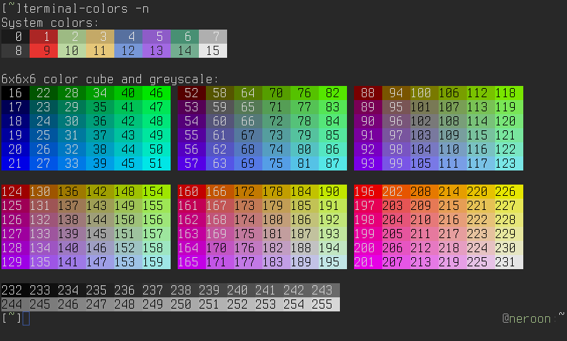
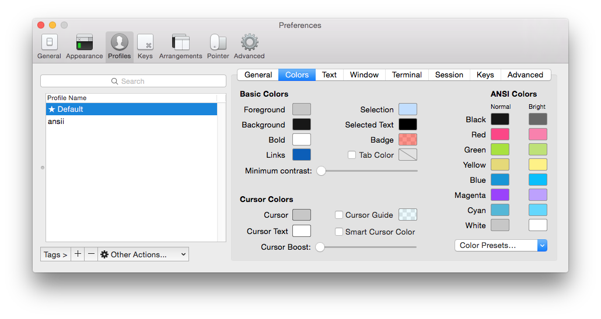
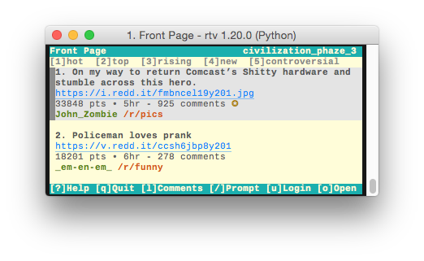
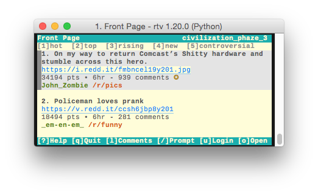

# Themes

## Installing Themes

You can install custom themes by copying them into your **~/.config/rtv/themes/**
directory. The name of the theme will match the name of the file.

```
$ cp my-custom-theme.cfg ~/.config/rtv/themes/
$ rtv --theme my-custom-theme
```

If you've created a cool theme and would like to share it with the community,
please submit a pull request!

## A quick primer on ANSI colors

Color support on modern terminals can be split into 4 categories:

1. No support for colors
2. 8 system colors - Black, Red, Green, Yellow, Blue, Magenta,
   Cyan, and White
3. 16 system colors - Everything above + bright variations
4. 256 extended colors - Everything above + 6x6x6 color palette + 24 greyscale colors

<p align="center">

<br><i>The 256 terminal color codes, image from <a href=https://github.com/eikenb/terminal_colors>https://github.com/eikenb/terminal_colors</a></i>
</p>

The 16 system colors, along with the default foreground and background,
can usually be customized through your terminal's profile settings. The
6x6x6 color palette and grayscale colors are constant RGB values across
all terminals. RTV's default theme only uses the 8 primary system colors,
which is why it matches the "look and feel" of the terminal that you're
running it in.

<p align="center">

<br><i>Setting the 16 system colors in iTerm preferences</i>
</p>

The curses library determines your terminal's color support by reading your
environment's ``$TERM`` variable, and looking up your terminal's
capabilities in the [terminfo](https://linux.die.net/man/5/terminfo)
database. You can emulate this behavior by using the ``tput`` command:

```
bash$ export TERM=xterm
bash$ tput colors
8
bash$ export TERM=xterm-256color
bash$ tput colors
256
bash$ export TERM=vt220
bash$ tput colors
-1
```

In general you should not be setting your ``$TERM`` variable manually,
it will be set automatically by you terminal. Often, problems with
terminal colors can be traced back to somebody hardcoding
``TERM=xterm-256color`` in their .bashrc file.

## Understanding RTV Themes

Here's an example of what an RTV theme file looks like:

```
[theme]
;<element>            = <foreground>  <background>  <attributes>
Normal                = default       default       normal
Selected              = default       default       normal
SelectedCursor        = default       default       reverse

TitleBar              = cyan          -             bold+reverse
OrderBar              = yellow        -             bold
OrderBarHighlight     = yellow        -             bold+reverse
HelpBar               = cyan          -             bold+reverse
Prompt                = cyan          -             bold+reverse
NoticeInfo            = -             -             bold
NoticeLoading         = -             -             bold
NoticeError           = -             -             bold
NoticeSuccess         = -             -             bold

CursorBlock           = -             -             -
CursorBar1            = magenta       -             -
CursorBar2            = cyan          -             -
CursorBar3            = green         -             -
CursorBar4            = yellow        -             -

CommentAuthor         = blue          -             bold
CommentAuthorSelf     = green         -             bold
CommentCount          = -             -             -
CommentText           = -             -             -
Created               = -             -             -
Downvote              = red           -             bold
Gold                  = yellow        -             bold
HiddenCommentExpand   = -             -             bold
HiddenCommentText     = -             -             -
MultiredditName       = yellow        -             bold
MultiredditText       = -             -             -
NeutralVote           = -             -             bold
NSFW                  = red           -             bold+reverse
Saved                 = green         -             -
Score                 = -             -             -
Separator             = -             -             bold
Stickied              = green         -             -
SubscriptionName      = yellow        -             bold
SubscriptionText      = -             -             -
SubmissionAuthor      = green         -             bold
SubmissionFlair       = red           -             -
SubmissionSubreddit   = yellow        -             -
SubmissionText        = -             -             -
SubmissionTitle       = -             -             bold
Upvote                = green         -             bold
Link                  = blue          -             underline
LinkSeen              = magenta       -             underline
UserFlair             = yellow        -             bold
```

Every piece of text drawn on the screen is assigned to an ``<element>``,
which has three properties:

- ``<foreground>``: The text color
- ``<background>``: The background color
- ``<attributes>``: Additional text attributes, like bold or underlined

### Colors

The ``<foreground>`` and ``<background>`` properties can be set to any the following values:

- ``default``, which means use the terminal's default foreground or background color.
- The 16 system colors:
  <p>
  <table>
    <tr><td>black</td><td>dark_gray</td></tr>
    <tr><td>red</td></td><td>bright_red</td></tr>
    <tr><td>green</td></td><td>bright_green</td></tr>
    <tr><td>yellow</td></td><td>bright_yellow</td></tr>
    <tr><td>blue</td></td><td>bright_blue</td></tr>
    <tr><td>magenta</td></td><td>bright_magenta</td></tr>
    <tr><td>cyan</td></td><td>bright_cyan</td></tr>
    <tr><td>light_gray</td></td><td>white</td></tr>
  </table>
  </p>
- ``ansi_{n}``, where n is between 0 and 255. These will map to their
  corresponding ANSI colors (see the figure above).
- Hex RGB codes, like ``#0F0F0F``, which will be converted to their nearest
  ANSI color. This is generally not recommended because the conversion process
  downscales the color resolution and the resulting colors will look "off".

### Attributes

The ``<attributes>`` property can be set to any of the following values:

- ``normal``, ``bold``, ``underline``, or ``standout``.
- ``reverse`` will swap the foreground and background colors.

Attributes can be mixed together using the + symbol. For example,
  ``bold+underline`` will make the text bold and underlined.

### Modifiers

RTV themes use special "modifer" elements to define the default
application style. This allows you to do things like set the default
background color without needing to set ``<background>`` on every
single element. The three modifier elements are:

- ``Normal`` - The default modifier that applies to all text elements.
- ``Selected`` - Applies to text elements that are highlighted on the page.
- ``SelectedCursor`` - Like ``Selected``, but only applies to ``CursorBlock``
  and ``CursorBar{n}`` elements.

When an element is marked with a ``-`` token, it means inherit the
attribute value from the relevant modifier. This is best explained
through an example:

```
[theme]
;<element>            = <foreground>  <background>  <attributes>
Normal                = ansi_241      ansi_230      normal
Selected              = ansi_241      ansi_254      normal

Link                  = ansi_33       -             underline
```

<p align="center">

<br><i>The default solarized-light theme</i>
</p>

In the snippet above, the ``Link`` element has its background color set
to the ``-`` token. This means that it will inherit it's background
from either the ``Normal`` (light yellow, ansi_230) or the ``Selected`` (light grey, ansi_254)
element, depending on if it's selected or not.

Compare this with what happens when the ``Link`` background is hard-coded to ``ansi_230``:

```
[theme]
;<element>            = <foreground>  <background>  <attributes>
Normal                = ansi_241      ansi_230      normal
Selected              = ansi_241      ansi_254      normal

Link                  = ansi_33       ansi_230      underline
```

<p align="center">

<br><i>The Link element hard-coded to ansi_230</i>
</p>

In this case, the ``Link`` background stays yellow (ansi_230) even when the link is
selected by the cursor.
